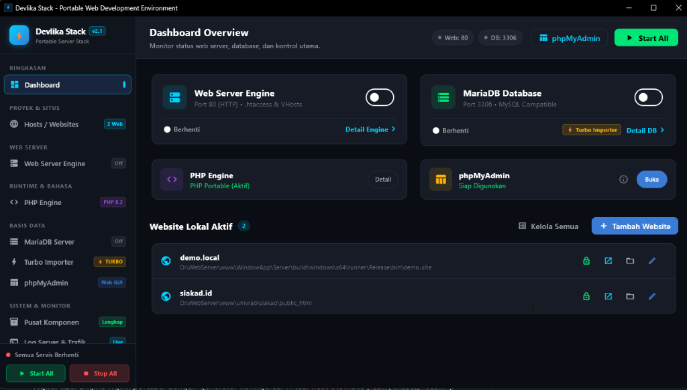

# DevlikaStack

**Bahasa Indonesia** | [English](README.en.md)

DevlikaStack adalah aplikasi desktop Windows yang ringan dan hemat resource untuk manajemen web server lokal serta database development environment. Dibuat menggunakan Flutter, aplikasi ini menggabungkan web server (Native HTTP / Nginx / Apache), multi-versi PHP via FastCGI daemon, MariaDB, dan phpMyAdmin dalam satu paket portabel tanpa perlu instalasi ke registry Windows.



---

## Fitur dan Fungsionalitas

### 1. Pilihan Web Server Engine
Aplikasi menyediakan tiga opsi web engine yang bisa diganti langsung dari dashboard:
- **Native HTTP Engine**: Web server internal berbasis Dart yang berjalan di port 80 dan 443. Dilengkapi parser `.htaccess` bawaan untuk URL rewrite (kompatibel dengan Laravel, CodeIgniter, WordPress, dan Single Page Application), Keep-Alive persistent connection, dan in-memory cache untuk berkas statis.
- **Nginx 1.26**: Engine Nginx portabel dengan generator konfigurasi virtual host otomatis (`conf/vhosts/*.conf`).
- **Apache HTTPD 2.4**: Engine Apache portabel untuk kebutuhan projek yang memerlukan modul Apache.

Pergantian engine dilakukan secara aman dengan melepas socket port 80/443 sebelum mengaktifkan engine baru.

### 2. Multi-PHP FastCGI Daemon Pool
Berbeda dengan web server lokal tradisional yang hanya menjalankan satu versi PHP secara global:
- Mendukung beberapa versi PHP aktif sekaligus (PHP 7.4, 8.1, 8.2, 8.3).
- Versi PHP dapat diatur berbeda untuk masing-masing virtual host / projek.
- Komunikasi menggunakan FastCGI daemon pool (`php-cgi.exe`) via TCP socket di port dedicated:
  - PHP 7.4: port `9074`
  - PHP 8.1: port `9081`
  - PHP 8.2: port `9082`
  - PHP 8.3: port `9083`
  - Default: port `9000`
- Worker pool dikelola dengan `PHP_FCGI_CHILDREN` dan akselerasi OPcache, sehingga request tidak perlu menunggu proses PHP baru di-spawn setiap kali halaman dimuat.

### 3. Database MariaDB & phpMyAdmin
- **MariaDB 3306**: Service database lokal dengan konfigurasi dual-stack loopback (`127.0.0.1` dan `::1`) serta `--skip-name-resolve`, mencegah delay DNS/IPv6 timeout pada Windows saat aplikasi PHP menghubungkan database via `localhost`.
- **phpMyAdmin**: Terintegrasi langsung dan dapat diakses lewat browser di path `/__phpmyadmin` dengan autentikasi otomatis ke MariaDB lokal.
- **SQL Importer**: Fitur import SQL dump besar dengan eksekusi bertahap (chunked transaction buffer) agar file SQL ratusan megabyte dapat diimpor tanpa memory limit atau timeout.

### 4. Virtual Host & Sinkronisasi Hosts File
- Menambahkan domain lokal kustom (contoh: `demo.local`, `siakad.id`).
- Otomatis memperbarui file Windows hosts (`C:\Windows\System32\drivers\etc\hosts`) dengan mendaftarkan entri IPv4 (`127.0.0.1`) dan IPv6 (`::1`) agar browser tidak melakukan lookup DNS eksternal.
- Auto-detect folder DocumentRoot: otomatis mengenali folder `public/index.php` (Laravel) atau `public_html/index.php` (CodeIgniter/arsitektur lama).
- **Reverse Proxy**: Mendukung proxy request dari domain lokal ke port aplikasi backend lain (Node.js, Go, Python, dsb).

### 5. SSL / HTTPS Lokal
- Menyediakan sertifikat SSL lokal otomatis untuk melayani koneksi HTTPS pada port 443 di semua engine web server.

### 6. Ringan, Portabel & System Tray
- **Hemat RAM & Tanpa VM**: Berjalan native langsung di Windows tanpa layer virtualisasi (seperti Docker Desktop atau VM WSL2) yang sering memakan RAM bergiga-giga saat ngoding.
- **Konsumsi Idle Minimal**: Pemakaian memori dan CPU saat standby sangat kecil; service hanya aktif memproses resource ketika ada request web atau query database.
- **Portabel Mandiri**: Seluruh berkas PHP, MariaDB, database pengguna, dan file konfigurasi tersimpan di dalam direktori aplikasi (`bin/` dan `storage/`) tanpa mengotori registry Windows.
- **System Tray**: Aplikasi bisa diminimize ke tray taskbar dan berjalan senyap di background tanpa membebani komputer saat membuka editor kode (VS Code, PhpStorm).
- Memiliki manifest `requireAdministrator` agar dapat mengelola port 80/443 dan file `hosts` sistem secara otomatis.

---

## Port dan Konfigurasi Default

| Layanan | Port Default | Keterangan |
|---|---|---|
| HTTP Web Server | `80` | Native HTTP / Nginx / Apache |
| HTTPS (SSL) | `443` | Sertifikat SSL lokal otomatis |
| MariaDB | `3306` | User: `root`, Password: *(kosong)* |
| phpMyAdmin | `80` | Akses via `http://localhost/__phpmyadmin` |
| FastCGI PHP 7.4 | `9074` | Daemon persistent worker pool |
| FastCGI PHP 8.1 | `9081` | Daemon persistent worker pool |
| FastCGI PHP 8.2 | `9082` | Daemon persistent worker pool |
| FastCGI PHP 8.3 | `9083` | Daemon persistent worker pool |

---

## Build dari Source

Prasyarat:
- Flutter SDK (3.12+)
- Visual Studio (dengan workload *Desktop development with C++*)
- Windows 10/11 64-bit

```bash
# Ambil dependency
flutter pub get

# Jalankan pengujian unit test
flutter test

# Build executable release
flutter build windows --release
```
